# ROS: Robot Operating System
### How to add an existing project to GitHub using the command line:
(https://help.github.com/en/github/importing-your-projects-to-github/adding-an-existing-project-to-github-using-the-command-line)
### ROS Workspace and ROS Package Notes
If you create a new workspace called `catkin_ws` in the path /home/user and use ROS Kinetic version, what is the command to execute to enable the workspace you created?  
`source /home/user/catkin_ws/devel/setup.bash`
setup.bash is located in the devel folder of the catkin workspace  

What does `roscd` command do?
Takes you to the last ROS workspace you have sourced its setup.bash. It does not take you to the default ROS package.  

It is a good practice to source your overlay workspace in the `.bashrc` rather than sourcing it every time when you open a new terminal.  

What is a `package.xml` file?  
<ul>- defines two types of dependencies:  
<ol>1. dependencies needed to build a package</ol>
<ol>2. dependencies needed to execute the package</ol>
</ul>
<ul>- used to describe the package and set its dependencies </ul>
<ul>- automatically generated when creating a new ROS package</ul>
<ul>- you can define a license of your package in the package.xml file</ul>  

What is the command used to create a new ROS package called my_package?  
```
cd ~/catkin_ws/src
catkin_create_pkg my_package std_msgs rospy roscpp
```
ROS workspaces:  
-A ROS workspace is a user directory that we will use to create the user ROS packages  
- A ROS workspace contains three main folders: a source, devel, and build folder  
-A ROS workspace is built using `catkin_make` command  

CMakelists.txt file:  
-The file `CMakeLists.txt` is the input to the CMake build system for building software packages  
-`CMakeLists.txt` file describes how to build the code and where to install it to  

## ROS Topics Overview
Publisher: nodes that produce information (ie. Odometry )  
Subscriber: nodes that consume information (ie. SLAM)  
For example: Odometry will publish Location information that contains (x,y,theta) to a particular topic so that the subscriber can get that information by subscribing to that particular topic.  
Note: can have multiple subscribers listening to one publisher  

### Message Communication
1. Run the Master ROS Node: The Master ROS Node maintains all the information about the ROS Network.  
2. Running the Subscriber: Node 2 is a subscriber for a particular topic. Node 2 will declare itself to the Master Node and provide relevant information (node name, topic name, message type). ROS Master Node will keep this information and wait for a publisher that meets the subscriber's criteria.  
3. Running the Publisher: Node 1 will declare itself to the Master Node, and declare relevant information about itself (name, topic name it will publish to, message type). The Master now has global knowledge of the network  
4. Provide Publisher Info: Master node tells Node 2 that there is a publisher node that Node 2 is looking for.  
5. Establish Connection Request: When Node 2 receives this information, Node 2 will send a request to connect to Node 1 using TCPROS protocol.  
6. Connection Response: Node 1 will send a response to accept the connection and start communication with Node 2. 
7. TCP Connection: Subscriber node creates a client for the publisher node using TCPROS and connects to the Publisher node. 
8. Message Transmission  

### Practical Tips to Write Publisher and Subscriber for ROS Topics
__Publisher__
1. Determine a __name__ for the topic to publish  
2. Determine the __type__ of the messages that the topic will publish  
3. Determine the __frequency__ of topic publication (how many messages per second)  
4. Create a publisher object with parameters chosen  
5. Keep publishing the topic message at the selected frequency  

__Subscriber__  
1. Identify the __name__ for the topic to listen to  
2. Identify the __type__ of the messages to be received  
3. Define a callback function that will be automatically executed when a new message is received on the topic  
4. Start listening for the topic messages  
5. Spin to listen forever (in C++)  

## Create Custom ROS Message
Defined by two thing: package_name/message_type (ie. std_msgs/String, geometry_msgs/Twist).  
Every ROS Message has some content which is defined by the type and field that has a value respect to its type. (ie. std_msgs/String message content is string data, with string being the type and field being the data.)  
__Steps to Create a New ROS Message__:  
1. create a msg folder in your package
2. create the message file with the file extension .msg
3. edit the message file by adding the elements (one per line)
4. Update the dependencies in package.xml and CMakeLists.txt
5. compile the package using catkin_make
6. make sure that your message is created using `rosmsg show`. 

Example from video: IoTSensor Message  
Message contents: id, name, temperature, humidity  
1. When creating the ros msg folder, make sure it's in the package folder and not anywhere else. (ie. ros_essentials_cpp)  
2. create the msg file IoTSensor.msg in the msg folder  
3. Updating dependencies: in package.xml, make sure the following are included: `<build_depend>message_generation</build_depend>` and `<exec_depend>message_runtime</exec_depend>`.  
In the CMakeLists.txt file, make sure the following is done: in find_package() add message_generation, in add_message_files() add IoTSensor.msg, in catkin_package() add message_runtime, and generate_messages is uncommented. 

## ROS Services
### What is a ROS Service?
1. ROS Server: the node that will provide the service  
2. ROS Client: the node that will consume the service  
Not like topic, service is __one-time__ communication. A client sends a request, then the server sends back a response.  

### When to use a ROS Service?
1. Request the robot to perform a _specific_ action (ie. path planning from point A to point B, spawn one robot in the simulator.)

### ROS Service line commands
`$ rosservice list`: lists all the services that are available
`$ rosservice info /name_of_service`: returns 
```
Node: name of the node that provides the service
URI: where the service is located on your system  
Type: the type of the message  
Args: the argument; when the client sends the request, it must send whatever arguments they must send.
```
`$ rossrv info Type`: ie. `$rossrv info turtlesim/Spawn`, returns the structure of the message. For example, `$rossrv info turtlesim/Spawn` will return:  
```
float32 x
float32 y
float32 theta
string name  
---  
string name
```
The arguments that the client needs to put down is on the upper half, and what the server will return is the lower half.  
__Example of using a service__:  
`$ rosservice call /spawn 7 7 180 t2`  
returns: `name: "t2"`  

### Steps to Write a ROS Service
The client will send a Request Message and the server will send back a Response Message.  
1. Define the service message (service file): will define the type of the message for the service request, and the type of the message for the service response. 
2. Create ROS Server node  
3. Create the ROS Client node: sends the request message and waits for the response message  
4. Execute the service  
5. Consume the service by the client  

For example:  
1. In ros_essentials_cpp, create a folder named 'srv'. In the srv folder, create a file called AddTwoInts.srv. In that file, we will define the type of message for the service request and response. It should look like the following:  
```
int64 a
int64 b
---
int64 sum
```
Go to package.xml and make sure the following is added:  
`<build_depend>message_generation</build_depend>` and `<exec_depend>message_runtime</exec_depend>`. These modules are responsible for reading the service file and converting it into source code for C++ and Python.   
Go to CMakeLists.txt and make sure you have:  
in `find_package` have message_generation  
in `add_service_files()` define the service file. ie. AddTwoInts.srv.

For that service file, we can find where it is created in: `~/catkin_ws/devel/include/ros_essentials_cpp`.   
__How to verify that your ROS service is working__: `rossrv list`  to see all the services created. 

2. Write ROS Service (Client/Server) in Python
__Server__: When writing a server, we will write something similar to a callback function for a subscriber node, which is known as a _handle_ function that is going to process the incomming message, formulate the response, and sends back the response to the client.  
__Primary function__ (in add_server.py): `add_two_ints_server('name of service', type of message to exchange, )`  
`rospy.Service`: creates a server that will be listening to incoming requests  
At the beginning of a python file, make sure to add the following so that we can access the service and messages defined for this service:
```python
from ros_essentials_cpp.srv import AddTwoInts
from ros_essentials_cpp.srv import AddTwoIntsRequest
from ros_essentials_cpp.srv import AddTwoIntsResponse
```
The `AddTwoIntsRequest` and `AddTwoIntsResponse` is in the devel folder when we compile the package.  
__Handle Function__: performs the service requested 
```python
def handle_add_two_ints(req):
    print "Returning [%s + %s = %s]"%(req.a, req.b, (req.a + req.b))
    # returns the response, contains only 1 argument
    return AddTwoIntsResponse(req.a + req.b) 
```

__Client__: sends the request to the server for the service  
At the beginning of a python file, make sure to add the following so that we can access the service and messages defined for this service:
```python
from ros_essentials_cpp.srv import AddTwoInts
from ros_essentials_cpp.srv import AddTwoIntsRequest
from ros_essentials_cpp.srv import AddTwoIntsResponse
```
The `AddTwoIntsRequest` and `AddTwoIntsResponse` is in the devel folder when we compile the package.  
The rest of the comments are in the `add_client.py` program.  
__Note__: When you run `$ rosrun ros_essentials_cpp add_two_ints_server` (which is the cpp server) and `$ rosrun ros_essentials_cpp add_client.py 7 9` the client/server still works even though the programs are written in different languages. This is possible because they exchange serialized messages. 

### Writing the turtlesim cleaner

Cleaning Application Overview (need these methods):  
```c++
void move(double speed, double distance, bool isForward);
void rotate(double angular_speed, double angle, bool clockwise);
double degrees2radians(double angle_in_degrees);
void poseCallback(const turtlesim::Pose::ConstPtr &pose_message);
double setAbsoluteOrientation(double desired_angle);
// double clean();
double getDistance(double x1, double y1, double x2, double y2);
// void moveGoal(turtlesim::Post goal_pose, double distance_tolerate);
```
How all ROS nodes should start:  
```c++
#include "ros/ros.h"

int main(int argc, char **argv) 
{
	ros::init(argc, argv, "robot_cleaner");
	ros::NodeHandle n;

	return 0;
}
```
In order to implement speed, must publish the messages. But first, must find what what messages to publish and where:  
`$ rosrun turtlesim turtlesim_node`
`$ rostopic list`  
/turtle1/cmd_vel: this is the topic that makes the robot move  
`$ rostopic info /turtle1/cmd_vel` :   
Type: geometry_msgs/Twist (this is the type of message is published to the /cmd_vel topic)  
`$ rosmsg show geometry_msgs/Twist`: show what the message type contains  
```
geometry_msgs/Vector3 linear  
  float64 x
  float64 y  
  float64 z  
geometry_msgs/Vector3 angular  
  float64 x
  float64 y  
  float64 z  
```
So, we must publish Twist message in order to make the turtlesim move.  
The rest of the notes are on `robot_cleaner.cpp`. Here are some further, non-code, but still important notes:  
When you compile with `catkin_make`, you will not be able to run the program (or even compile successfully).  
In your __CMakeLists.txt__: 
```
catkin_package(
#  INCLUDE_DIRS include
#  LIBRARIES turtlesim_cleaner
  CATKIN_DEPENDS other_catkin_pkg roscpp rospy std_msgs geometry_msgs message_runtime
#  DEPENDS system_lib
)
...
## Declare a cpp executable
add_executable(robot_cleaner_node src/robot_cleaner.cpp)
target_link_libraries(robot_cleaner_node ${catkin_LIBARIES})
add_dependencies(robot_cleaner_node beginner_tutorials_gencpp)
```
In your package.xml file:  
```xml
<build_depend>roscpp</build_depend>
  <build_depend>rospy</build_depend>
  <build_depend>std_msgs</build_depend>
  <build_depend>geometry_msgs</build_depend>
  <build_depend>message_generation</build_depend>

  <exec_depend>roscpp</exec_depend>
  <exec_depend>rospy</exec_depend>
  <exec_depend>std_msgs</exec_depend>
  <exec_depend>geometry_msgs</exec_depend>
  <exec_depend>message_runtime</exec_depend>
```

## Network Configuration in ROS
Although there is already a guide on Confluence, that is between two physically separate computers.  
This guide will show how to configure the ROS Network Configuration between 2 VMs, the __User Workstation__ and the __Robot Machine__  

Goal: control the Robot Machine remotely from the User Workstation  

Note: ROS must be installed on both the Robot Machine and the User Workstation  

#### Configuring the Robot Machine
In the Robot Machine, open the bashrc file: `$ gedit .bashrc`  

In the Robot Machine, we need to add some IP addresses. In order to find out which IP addresses to add, type `$ ifconfig` into the Robot Machine terminal window.  

Copy the IP address that is listed after `inet addr:` and paste it into the .bashrc file in the following format: `export ROS_HOSTNAME= ip address`, `export ROS_IP = ip address`, `export ROS_MASTER_URI=http://localhost:11311`    

Add the next three lines into the Robot Machine .bashrc file to display the environment variables that we have set when you open a new terminal:
```
echo "ROS_HOSTNAME: "$ROS_HOSTNAME
echo "ROS_IP: "$ROS_IP
echo "ROS_MASTER_URI: "$ROS_MASTER_URI
```
#### Configuring the User Workstation: 
In the User Workstation, open the bashrc file: `$ gedit .bashrc`  

Find the IP address of the user workstation by typing `$ ifconfig` into the User Workstation terminal window. Copy the ip address that's listed after `inet addr:`.  

Paste the ip address into the .bashrc file in the following format: `export ROS_HOSTNAME= ip address`, `export ROS_IP = ip address`. However, the ROS_MASTER_URI will be different.  

The IP address listed after ROS_MASTER_URI in the .bashrc file will be the ip address found on the Robot Machine. In the .bashrc file, it will look like the following: `export ROS_MASTER_URI = http://ip address of robot machine` except replace the words "ip address of robot machine" with the actual ip address.  

#### Communicating between User Workstation and Robot Machine
1. Run `$ roscore` on the Robot Machine  
2. Run `$ rosrun turtlesim turtlesim_node` on the Robot Machine  
3. Run `$ rostopic list` on the Robot Machine. A list of the available topics should print out.   
4. Run `$ rostopic list` on the User Workstation. The same list of the available topics should print out. Note: do NOT run `$ roscore` on the User Workstation.  

When the ROS master node is terminated on the Robot Machine, and you try to run `$ rostopic list` on the Robot Machine again, an error message saying `ERROR: Unable to communicate with master!` will pop up. This is because the workstation is no longer connected to the ROS Master of the robot. 

#### VM Configuration
If you did all those steps and the test communication above, and you get an error, try the following:  
[VMware PLayer Bridged Network not Working](https://www.youtube.com/watch?v=fheU2ER9tss)  
Do this configuration for both the User Workstation VM and the Robot Machine VM

## Launch File
What is a Launch file?  
- __launch file__: is a xml document, which specifies: which nodes to execute, their parameters, what other launch files to include. Has a .launch extension  
- __roslaunch__: is a program that easily launches multiple ROS nodes  

### How to write a launch file: 
First, create a launch directory in the package you are working in. For example, if you are working in the `turtlesim_cleaner` package, then you type the following into the terminal:  
` user@ubuntu:~/catkin_ws/src/turtlesim_cleaner$ mkdir launch` 
` user@ubuntu:~/catkin_ws/src/turtlesim_cleaner/launch$ touch clean_py.launch` 
```xml
<launch>
  <node pkg="turtlesim" type="turtlesim_node" name="turtlesim_node" output="screen"/>
  <node pkg="turtlesim" type="turtle_teleop_key" name="turtlesim_teleop_node" output="screen"/>
  <node pkg="turtlesim_cleaner" type="clean.py" name="clean" output="screen"/>
```
`pkg`: specifies the package name that the node is under  
`type`: name of the executable file. For c++ files, the formatting is like the first two nodes, for python scripts, the formatting is like the last node.  
`name`: a custom name that we can specify for that node  

To use the launch file, compile your workspace using `$ catkin_make` and launch it by `$ roslaunch package_name launch_file_name.launch`  

### Putting a Launch File Within a Launch File:  
Let's say we are creating another launch file called `launch_all.launch` and it will have the launch file we already made, `clean_py.launch` and another node. The format will look like the following
```xml
<launch>
  <include file="$(find turtlesim_cleaner)/launch/clean_py.launch"/>
  <node pkg="ros_essentials_cpp" type="turtlesim_cleaner.py" name="turtlesim_cleaner_node_py"/>
</launch>
```
The `find` command will return the absolute path of turtlesim_cleaner (or whwatever other package you put there) and then further specify the path of the launch file within the package.  

### Parameters in Launch Files:

If you want to have parameters in your nodes, then you must do the following:  
1. In the launch file, define the parameters _BEFORE_ the node is called so that they are registered in the parameter server. Also, make sure to add `output="screen"` to see the print statements. 
```xml
<launch>
  <include file="$(find turtlesim_cleaner)/launch/clean_py.launch"/>
  <param name="x_goal" value="2.0"/>
  <param name="y_goal" value="3.0"/>
  <node pkg="ros_essentials_cpp" type="turtlesim_cleaner.py" name="turtlesim_cleaner_node_py" output="screen"/>
</launch>
```
2. In the package src code, define the parameters. For example, if you wanted to use parameters in `turtlesim_cleaner.py`, define as follows:
```python
if __name__ == '__main__':
    try:
        
        rospy.init_node('turtlesim_motion_pose', anonymous=True)

        #declare velocity publisher
        cmd_vel_topic='/turtle1/cmd_vel'
        velocity_publisher = rospy.Publisher(cmd_vel_topic, Twist, queue_size=10)
        
        position_topic = "/turtle1/pose"
        pose_subscriber = rospy.Subscriber(position_topic, Pose, poseCallback) 
        time.sleep(2)

        #move(1.0, 2.0, False)
        #rotate(30, 90, True)

        x_goal = rospy.get_param("x_goal")
        y_goal = rospy.get_param("y_goal")

        print('x_goal = ', x_goal)
        print('y_goal = ', y_goal)

        go_to_goal(x_goal, y_goal) 
        #setDesiredOrientation(math.radians(90))
       
    except rospy.ROSInterruptException:
        rospy.loginfo("node terminated.")
```

## OpenCV for ROS
- Open Source CV library  
- BSD License  
- free for both academic and commerical use  
- C++/Python/Java  
- Windows, MacOS, Linux, iOS, Android
- Strong focus on real time (written in C++ and optimized)

__Image Segmentation__: process of partioning a digital image into multiple segmentation, used to locate objects and boundaries (lines, curves, etc) in images  
__Image Thresholding__: from a grayscale image, thresholding can be used to create binary images, any color above the threshold is white, and any color below is black  
__Object Detection and Recognition__: detecting instances of semantic objects of a certain class in digital images and videos  
__Drawing__: draw different shapes (circle, lines, polyglons, etc)  
__Edge detection__: works by detecting discontinuities in brightness, used for image segmentation and data extraction  
__Video/Image Input Output__: openCV makes it simple to read/write images or videos  

### Pixels and Image Structure 
__numpy__ is a scientific library that allows us to represent an image as a data structure and offers a lot of functionality to process multi-dim arrays.  

Whenever you read an image or you get an image in openCV, you can access any of its pixel by manipulating the numpy array.  

```python
import numpy
import cv2
```
See ros_essentials_cpp/src/topic03_perception/image_structure.py for a walkthrough. 

### Image Encoding
Three main encoding:  
- grayscale
- red, green, blue
- hue, saturation, value
<ul>__Hue__: indicates the type of color that we see in a 360 degree format</ul>
<ul>__Saturation__: an indication of how saturated an individual color is, i.e. is the amount of gray in the color, from 0 to 100%</ul>
<ul>__Value (brightness)__: the brightness or intensity of the color, from 0-100 percent, where 0 is completely black and 100 is the brightest and reveals the most color</ul>

See ros_essentials_cpp/src/topic03_perception/image_encoding.py for a walkthrough.  

Teacher summary: In openCV, you can open an image and then transform the image into different encodings.  

### Video Input Streams
See ros_essentials_cpp/src/topic03_perception/read_video.py for a walkthrough.

### OpenCV: Drawing Shapes and Lines
See ros_essentials_cpp/src/topic03_perception/image_draw.py for a walkthrough.  

Why drawing is important: in object detection, we can draw a rectangle around the object detected. 

### CvBridge: Bridging Images between OpenCV and ROS 
In ROS: images are collected from the topics that are published by the drivers of the camera. So how do we bridge ROS and OpenCV?  
Must create a subscriber in ROS to receive the image and then send the image to OpenCV for further processing. However, _the image files from ROS is not compatible with OpenCV_. Must transform the image from ROS to OpenCV format, and vice versa.  

__CvBridge__: allows conversion from ROS format to OpenCV format and vice versa.  

If you have a USB camera attached, you can run image_pub_sub.py script by doing the following:  `$ rosrun usb_cam usb_cam_node _pixel_format:=yuyv`  
How to verify if the camera is working: `$ rosrun image_view image_view image:=/usb_cam/image_raw`  
Then to run the python script: `$ rosrun ros_essentials_cpp image_pub_sub.py`  

Now we can do image processing with ROS and OpenCV! 

### Simple and Adaptive Thresholding in OpenCV
__Algorithm__: If a pixel value is greater than a threshold it's assigned a certain value and if it's lower than a threshold it's assigned another value  

__Simple thresholding__:`cv2.threshold(gray_image, threshold_value, max_value, threshold_style)`  
__Adaptive thresholding__: `cv2.adaptive_thresholding(gray_image, max_value, adaptive_method, block_size, constant)` algorithm calculates the threshold for a small region of the image. Different threshold will be calculated for different regions of the same image, better robustness for different lighting conditions.  
`cv2.ADAPTIVE_THRESH_MEAN_`: threshold value is mean of neighborhood area  
`cv2.ADAPTIVE_THRESH_GAUSSIAN_C`: threshold value is the weighted sum of neighborhood values where weights are a gaussian window.  
Block size: decides size of neighborhood area  
C: constant which is subtracted from the mean or weighted mean calculated  

Thresholding is important in CV, like in contour detection. 

See ros_essentials_cpp/src/topic03_perception/image_thresholding.py for a walkthrough.  

### Color Filtering
__Color Filtering__: display only a specific color range in the image  
__Usage__: detection of objects with specific colors  
__Algorithm__: read image as RGB image, convert image to HSV image, define the upper and lower color ranges, create the mask based on color ranges  

_Why do we use HSV colorspace for color detection/thresholding over RGB?_: HSV is more robust towards external lighting changes

See ros_essentials_cpp/src/topic03_perception/color_filtering.py for a walkthrough.  

### Contours
__Edge detection__: image processing technique for finding the _boundaries of objects within images_  
- Contours are a curve joining all the continuous points (along the boundary), having same color or intensity  
- works by detecting discontinuities in brightness  
__Usage__: useful tool for shape analysis, image segm and object detection/recognition  
__Algorithm__: read image as RGB image, convert image to _grayscale_ image, convert gray image into binary image, find the contours using `cv2.findContours()` applied on the binary image, process the contours (find its areas, enclosing circle, perimeter, moment, and centroid)  

`RETR_LIST`: simply retries all contours, but doesn't create any parent-child relationship. Parents and kids are equal under this rule, and they are just contours, ie. they all belong to the same hierarchy level.  
`RETR_EXTERNAL`: if you use this flag, it returns only extreme outer flags. All child contours are left behind. We can say under this law, only the eldest in every family is taken care of.  
`RETR_CCOMP`: flag retrieves all the contours and arranges them to a 2-level hierarchy. External contours of the object (boundary) are placed in hierarchy-1. Contours of holdes inside object (if any) is placed in hierarchy-2.  
`RETR_TREE`: retrieves all contours and creates a full family hierarchy list. It tells who is the grandpa, father, son, grandson and so on. 

### OpenCV Programs in C++

#### Video Input/Output
1. Must include the following headers in your code:
```cpp
#include "opencv2/opencv.hpp"

using namespace cv;
```
2. In the main function, have the VideoCapture object to opent the default camera:
```cpp
VideoCapture video_capture(0); // open the default camera
```
The [Mat](https://docs.opencv.org/trunk/d3/d63/classcv_1_1Mat.html) class defines the structure of the frame and then use the video_capture object to collect the frames:
```cpp
 while(true){
        // structure of frame 
        Mat frame;
        video_capure >> frame;
}
```
3. Apply any OpenCV operations on the image:
```cpp
cvtColor(frame, gray_image, COLOR_BGR2GRAY);
GaussianBlur(edges, edges, Size(7,7), 1.5, 1.5);
Canny(edges, edges, 0, 30, 3);
```
4. Unlike Python, we must specify the executable in the CMakeLists.txt file. Make sure to link the OpenCV library:
```txt
find_package(OpenCV)
include_directories(${OpenCV_INCLUDE_DIRS})
add_executable(read_video_cpp src/topic03_perception/cpp/read_video.cpp)
target_link_libraries(read_video_cpp ${catkin_LIBRARIES})
target_link_libraries(read_video_cpp ${OpenCV_LIBRARIES})
```
5. Compile with catkin_make, run roscore, and then use rosrun to run the program.

#### Open and Save Images
1. Import the appropriate OpenCV libraries   
2. Define an image structure with the Mat class 
3. Read the image file from a specific path. Here, the absolute path is provided:
```cpp
image = imread("/home/skylar/catkin_ws/src/ros_essentials_cpp/src/topic03_perception/images/chess.jpg", CV_LOAD_IMAGE_COLOR);
```
If the absolute path is not specified, then must run the node from the same file and same directory it is located. So, it's just better to put the absolute path.  
4. Display the image with the method `imshow`:
```cpp
//DISPLAY image
namedWindow( "window", CV_WINDOW_AUTOSIZE ); // Create a window for display.
imshow( "window", image ); // Show our image inside it.
```
5. We can also save the image in a different location with `imwrite`:
```cpp
//SAVE image
imwrite("/home/skylar/tmp/copy_image.jpg",image);// it will store the image in name "result.jpg"
```
6. As usual, must add the executable to CMakeLists.txt:
```
add_executable(open_copy_cpp src/topic03_perception/cpp/open_copy.cpp)
target_link_libraries(open_copy_cpp ${catkin_LIBRARIES})
target_link_libraries(open_copy_cpp ${OpenCV_LIBRARIES})
```

#### CvBridge: Bridging Images between OpenCV and ROS
As stated before, the images in OpenCV and ROS are in different formats. We need to convert each format to the other in order to use both OpenCV and ROS. Like we did in Python, we will bridge images between OpenCV and ROS in C++.  
1. Make sure that OpenCV and CvBridge are the most updated versions with `sudo apt-get update` and `sudo apt-get install ros-kinetic-opencv3` and `sudo apt-get install ros-kinetic-cv-bridge`  
2. Import the appropriate libraries:
```cpp
#include <image_transport/image_transport.h>
#include <cv_bridge/cv_bridge.h>
#include <sensor_msgs/image_encodings.h>
#include <opencv2/imgproc/imgproc.hpp>
#include <opencv2/highgui/highgui.hpp>
```
3. Publishing and Subscribing: The subscription to a topic is NOT done with the node handler (as we have done so before) because we are subscribing not to a topic, but to an image. The ImageTransport object will be used to create a subscriber for the image topic and the publisher for the image topic:
```cpp
class ImageConverter
{
  ros::NodeHandle nh_;
  image_transport::ImageTransport it_;
  image_transport::Subscriber image_sub_;
  image_transport::Publisher image_pub_;

public:
  ImageConverter()
    : it_(nh_)
  {
    // Subscribe to input video feed and publish output video feed
    image_sub_ = it_.subscribe("image", 1,
      &ImageConverter::imageCallback, this);
    image_pub_ = it_.advertise("/image_converter/output_video", 1);

    cv::namedWindow(OPENCV_WINDOW);
  }
```
4. Callback function: takes in a pointer to the Image message, and then create a cvbridge object. Converts the message from callback function to openCV frame format (encoding is BGR8)
```cpp
void imageCallback(const sensor_msgs::ImageConstPtr& msg)
  {
    cv_bridge::CvImagePtr cv_ptr;
    try
    {
      // converts from ROS format to openCV format
      cv_ptr = cv_bridge::toCvCopy(msg, sensor_msgs::image_encodings::BGR8);
    }
```
5. Display the image in a window and publish it to a topic:
```cpp
// Update GUI Window
cv::imshow(OPENCV_WINDOW, cv_ptr->image);
cv::waitKey(3);

// Output modified video stream
// Convert this openCV message to a ROS sensor_msgs::Image message. 
image_pub_.publish(cv_ptr->toImageMsg());
```
5. Add executable to CMakeList.txt: add cv_bridge and image_transport packages to the find_package, and add the executable
```
find_package(catkin REQUIRED COMPONENTS
  roscpp
  rospy
  std_msgs
  actionlib_msgs
  message_generation
  geometry_msgs
  turtlesim
  cv_bridge
  image_transport
)
```
```
add_executable(image_pub_sub_cpp src/topic03_perception/cpp/image_pub_sub.cpp)
target_link_libraries(image_pub_sub_cpp ${catkin_LIBRARIES})
target_link_libraries(image_pub_sub_cpp ${OpenCV_LIBRARIES})
```
6. Compile using catkin_make, and run it by using rosrun
7. (OPTIONAL) Instead of running each node manually, you can create a launch file to launch several nodes at once. For example:
```xml
<launch>
  <node name="usb_cam_node" pkg="usb_cam" type="usb_cam_node" output="screen">
    <param name="video_device" value="/dev/video0" />
    <param name="image_width" value="1280"/>
    <param name="image_height" value="720"/>
    <param name="pixel_format" value="yuyv"/>
    <remap from="image" to="/camera/image_raw"/>
  </node>
  <node name="image_view_node" pkg="image_view" type="image_view" output="screen" >
    <remap from="image" to="/usb_camera_node/image_raw"/>
  </node>
  <node name="image_pub_sub_cpp" pkg="ros_essentials_cpp" type="image_pub_sub_cpp" pkg="ros_essentials_cpp" output="screen" >
    <remap from="image" to="/usb_camera_node/image_raw"/>
  </node>
  <node name="image_view2_node" pkg="image_view" type="image_view" output="screen" >
    <remap from="image" to="/image_converter/output_video"/>
  </node>
</launch>

```

## Laser Scanners and ROS
Laser Scanners: device that can measure the distance to obstacles. It uses laser beams and it's used in robotics applications like SLAM, obstacle avoidance, and navigation. Very useful and necessary for building navigation tools.  
Laser Scanner Characteristics:
- Minimum angle: start angle of the scan  
- Maximum angle: end angle of the scan  
- Angle increment (angular resolution): angular distance between measurements  
- Time increment: time between measurements  
- Scan time: time between two scans  
- Minimum range: minimum observable range value  
- Maximum range: maximum observable range value  
- List of ranges: list of all measurements in a scan  
- List of intensities: list of all intensities in a scan  

### Connecting an RGBD Camera as a Laser Scanner (ASUS Live Pro with ROS Kinetic)
1. Start the drivers of the RGBD camera by using the Openni Package that comes with ROS:  
- Make sure that it is installed, and then launch it with `$ roslaunch openni2_launch openni2.launch`.  
- This will start all the drivers that will be responsible for connecting with the RGBD cameras and extracting info to publish as ROS topics.  
- Openni is a general driver that works with many commercially available RGBD cameras (ie. Microsoft Kinect) however for ROS Kinetic, the Asus Live Pro camera is the best compatibility. 
2. Convert Depth Image to Laser Scanner:  
- When you start the driver, the RGBD camera will publish several types of images such as raw images, compressed images, and depth images which contains the depth information coming from the laser scanner. However, it is necessary to convert the depth camera into scan readings.  
- The package to do this conversion is the following. The execution of the node is done in a launch file because we need to remap the image topic to the correct depth image. 
```xml
<launch>
  <node name="depthimage_to_laserscan" pkg="depthimage_to_laserscan" type="depthimage_to_laserscan">
    <remap from="image" to="/camera/depth/image_raw"/>
  </node>
</launch>
```
3. Open with rviz and test with rostopic echo  
4. In your VM Settings under USB Connections, checck to see that the RGBD camera is connected.  
5. Make sure your system is up to date with `$ sudo apt-get update`  
6. Install Openni: `$ sudo apt-get install ros-kinetic-openni2-*`  
7. Start the launch file: `$ roslaunch openni2_launch openni2.launch`  
8. In order to see all the topics published by the camera, you can use `$ rostopic list`.  
- `$ rosrun image_view image_view image:=/camera/rgb/image_raw` will open up a window with the camera feed. 
- `$ rosrun image_view image_view image:=/camera/depth/image_raw` will show the depth video stream  
9. Rviz: ROS Vizualization is a tool that allows you to visualize different topics. `$ rosrun rviz rviz`

### Save Laser Scan Messages Into a Bag File and Replay Them
__Rosbag__: utility in ROS that allows to record messages published by topics into a file, and them replay them again. This technique is useful to develop and test algorithms and to replay existing scenarios or experiments.  
For example, if we wanted to record the messages sent from a laser scanner:  
1. Run ROS Master  
2. On another terminal, run the urg node: `$ rosrun urg_node urg_node`
3. On another terminal, run a static transform publisher: `$ rosrun tf static_transform_publisher 0.0 0.0 0.0 0.0 0.0 0.0 1.0 map laser 10`  
4. On another terminal, make a bagfiles directory: 
```
$ cd
$ mkdir bagfiles
$ cd bagfiles
```
5. Before collecting the files in bagfiles, start rviz in another terminal: `$ rosrun rviz rviz`. Click the Add button at the bottom to add informatio about the Laser Scanner (under LaserScan). Select /scan topic for "Topic". Add the axes frame by going to Add > Axes > OK
6. Now you can start recording. In `~/bagfiles` terminal, run `$ rosbag record -a` that will record everything. The -a flag records all the messages coming from the active topics.  
7. In order to stop recording, on the terminal screen that you ran `$ rosbag record -a`, Ctrl+C will stop the recording. Repeat this for all the other terminals, including the driver and the ROS Master.  
8. In order to replay the bag files, re-run ROS Master, and re-open rviz. There will be no data being shown in rviz because we will load from a bag file.  
9. In `$ ~/bagfiles` if you do `$ ls` you can see a file with a .bag extension. That is the bag file. We can look at information about the bag file using `$ rosbag info name_of_bagfile.bag`.  
10. To play the bag file, run `$ rosbag play name_of_bagfile.bag` and go to the rviz screen. Change the "Topic" to /scan to replay the info we just recorded.  

### Write a ROS Node as a Subscriber to a Laser Scanner
1. Start the drivers of the laser scanner  
2. Make sure that /scan topic is available  
3. Write a node that subscribes to the /scan topic  
4. Write a callback function that receives the /scan messages and process them (min, max, average,...)  

Check out scan_subscriber.py in ros_code for an example.

## Rosserial
__Rosserial__: protocol for wrapping standard ROS serialized messages and multiplexing multiple topics and services over a character device such as a serial port or network socket. Basically a protocol that was designed in order to communicate between ROS and a new hardware.
__Why Rosserial?__  
- Integration of micro-controllers and embedded systems into ROS  
- Adding new embedded hardware (sensors, controllers, etc)  
- Need for a communication protocol between new hardware and ROS  
- Without rosserial: re-invent the wheel and new hardware drivers (oof)  
__What is Rosserial?__  
- rosserial allows new electronic hardware to directly talk to ROS system  
- No need for customer drivers and communication protocol (very time consuming)  
__Rosserial Client Libraries__:
- different client libraries were developed to get ROS up and running on various systems  
- __rosserial_client__: generic client-side rosserial implementation. Designed for microcontrollers and it can run on any processor that has ANSI C++ compiler and a serial port connection to a computer running ROS (ie. rosserial_arduino). 
- __rosserial_python__: Python-based implementation (recommended for PC usuage)  
- __rosserial_server__: A C++ implementation, has some limitations compared to the python version but recommended for high-performance applications

### Arduino
__What is Arduino?__  
- open source electronics platform  
- easy to use hardware and software  
- read an input (light sensor, fingerprint, etc)  
- write output (activate motor, turn led on/off)  
- Use C for programming (Arduino IDE)  
- Used in many applications: prototyping, IoT, Robotics, embedded systems, etc  

__Why Arduino?__  
- cheap  
- cross platform  
- simple, clear programming environment  
- open source and extensible software/hardware  
- different types of Arduino boards that allows you to connect to the internet  

#### Arduino IDE: Example of Temperature Sensor 
Made up of 2 main important functions:  
1. setup
```c
void setup()
{
  // Start the serial connection with the computer
  // to view the result, open the serial monitor
  Serial.begin(9600); 

}
```
2. loop: the method loop will run forever and all application logic must be defined in the method loop
```c
void loop()
{
  // code here
}
```

__Note__: If we want to connect the data that the Arduino gets from the sensors, we need to install rosserial libraries to connect the Arduino to the ROS ecosystem.  

#### Install rosserial libraries
[ROS Documentation: rosserial](http://wiki.ros.org/rosserial)

# ROS for Beginners II: Localization, Navigation, and SLAM

## ROS Navigation Demo 
### Set Up
1. Open a terminal and export the TurtleBot3 model in your bashrc file.  
In your terminal: `$ gedit ~/.bashrc`  
In the bashrc file: `export TURTLEBOT3_MODEL=waffle`. Save the bashrc file edits with either Ctrl+C or click on the Save button. Exit out of the bashrc file and back to the terminal. In your terminal, in order for the changes to be reflected, type in the command: `$ source ~/.bashrc`  
2. Go to where you downloaded the tb3_house_map file and right click on the pgm file and click on properties. Copy the file location with the file name. Right click on the yaml file and open with gedit. Past the pgm file location you copied, after "image: ". Hit save, and then close. 
3. Start the Gazebo simulation: `$ roslaunch turtlebot3_gazebo turtlebot3_house.launch`  
4. Open another terminal and load the navigation stack: `$ roslaunch turtlebot3_navigation turtlebot3_navigation.launch map_file:=/home/skylar/tb3_house_map.yml`. Remember to replace /home/skylar/tb3_house_map.yml path with the path that you have.  
5. When you start both Gazebo and Rviz, your screen should look like this:  
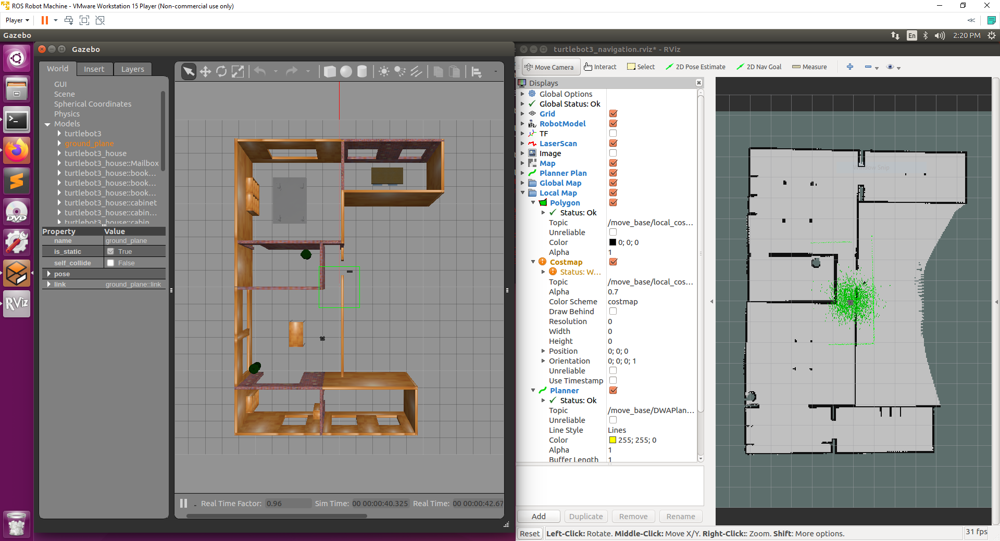  

### Setting the initial location of the robot
6. Robots do not know initially their start locations. We have to tell them manually. In the Rviz navigation interface, click on 2D Pose estimate and click on the area of the map that will align the Rviz map with the Gazebo map. You will know when it is aligned if the laser scan readings are not deviated and line up with the map.  
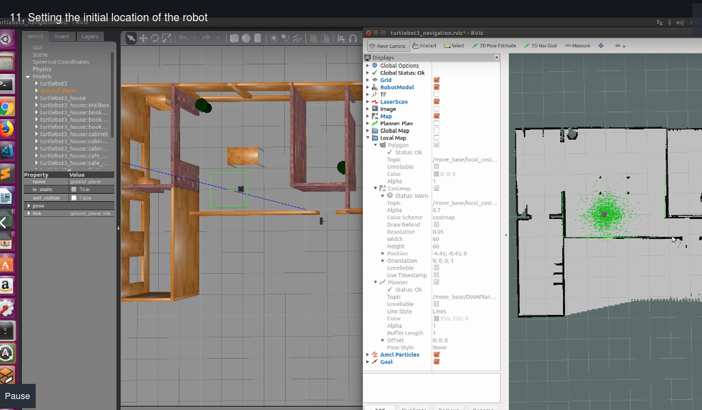  

### Frames
7. What is the location and orientation of the robot? In order to know this information, we can look at the list of topics: `$ rostopic list`  
8. We want to identify the topic that represents the location of the robot. However, before doing that, we must observe the following:  
In Rviz, there is a grid overlay that can be turned on/off. In the middle of the grid is the origin point (0,0). This is called the __reference frame__ that we use to determine the location of the robot.  
We can visualize this frame on Rviz by using the __tf__ topics that show us all the frames. To do this in Rviz, go to Add > TF.  
9. A __frame__ is a reference that is used to localize objects/robots.  
TF allows us to visualize different frames like /odom and /map.
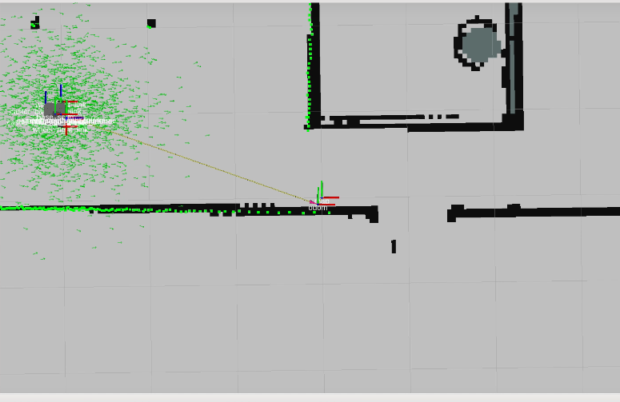  
/map is the global map frame  
/odom is the a frame that will be covered in a later section.  
Under Global Options, you can choose to view different frames under Fixed Frame.

### Location of the Robot in Different Frames
/odom: topic represents a pose based on odometry information. 
`$ rostopic echo /odom` will show the name of the reference frame and the location of the robot with respect to the odom frame (along with other information).  
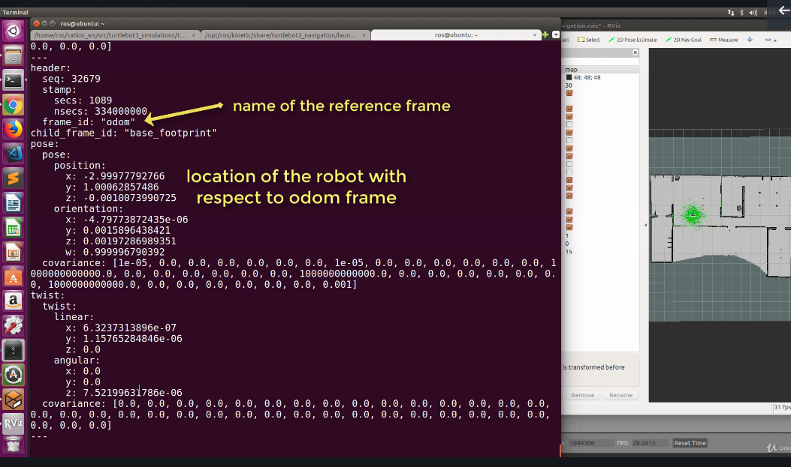  

/amcl_pose: topic represents the global pose of the robot in the environment with respect to the global map frame
`$ rostopic echo /amcl_pose` will also show the name of the reference frame and the location of the robot with respect to the map frame (along with other information)  
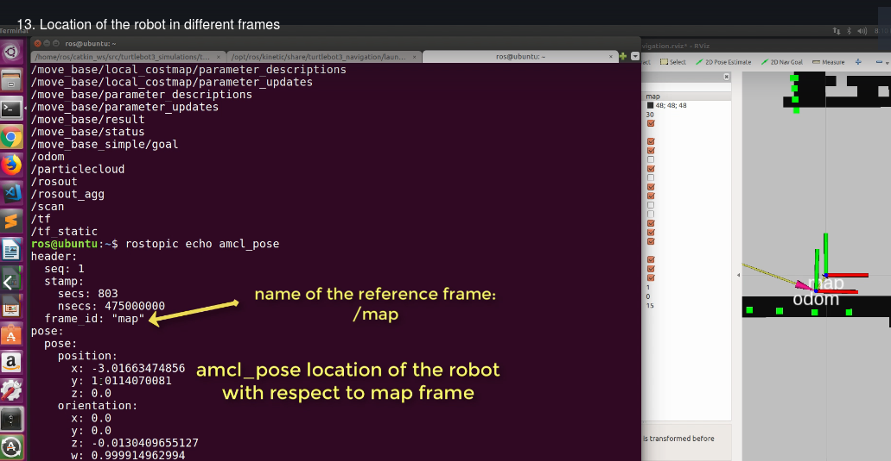 

__Note__: robots can have different types of locations based on the reference frame  

### How is Orientation Represented in 3D space?
`$ rostopic echo /odom` will return 4 values (x,y,z,w) for the orientation of the robot. This is the __quaternion__ representation of orienation.  
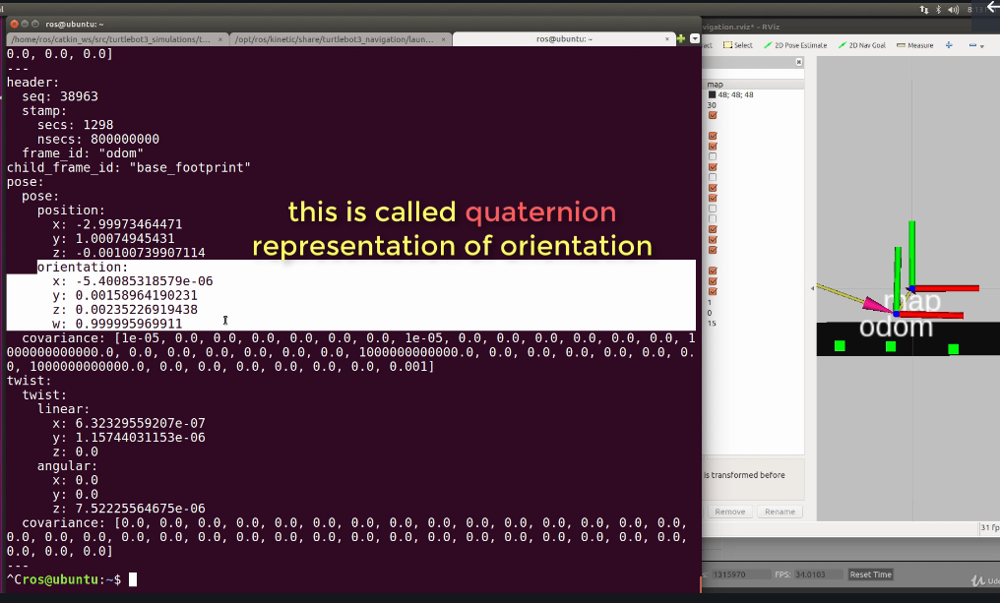

## 2D Frames, Tranformations, and Localization

### Pose of a robot in a frame
Pose: The pose of the robot is represented by the (x,y) coordinates and the orientation in a 2D frame.  In order to have a pose, we need a reference frame. Tranformations between two frames involves a translation and rotation between the two frames.  

### Dealing with Multiple Frames
Location of an object is dependent on the coordinate frame.  
In robotics, a robot knows its location in the environment in respect to the world frame and observes objects around them (such as a person) and locates those objects in respect to their frame (the robot frame).  
The question is: What is the location of the Person the World Frame F{W} if the robot knows its location in the F{W} and the location of the person in the Robot Frame F{R}?

### Coordinate Frame Transformation
Transformation Types:  
- Translation: a frame is translated by a certain vector with respect to another frame    
- Rotation: frame is rotated a certain angle in respect to another frame  

- Pure Rotation: just rotation, no translation  
- Transformation: Translation + Rotation  

### 2D Translation
A system of equations can be used to represent the relation of the position of the robot in two different frames related by a translation.  
The example in the video is the following (pure translation):  
w1_x = w2_x + 3  
w1_y = w2_x + 2  

### 2D Rotation
Note: ROS libraries does all these calculations for us!  
w1_x = cos(theta) * w2_x - sin(theta) * w2_y  
w1_y = sin(theta) * w2_x + cos(theta) * w2_y  

which... is just a rotation matrix (pure rotation) (bad formatting sorry)  
[w1_x] = [cos(theta) -sin(theta)] * [w2_x]
[w1_y] = [sin(theta) cos(theta)]  * [w2_y]  

### 2D Transformation: Translation + Rotation
Counterclockwise rotation angle theta:  
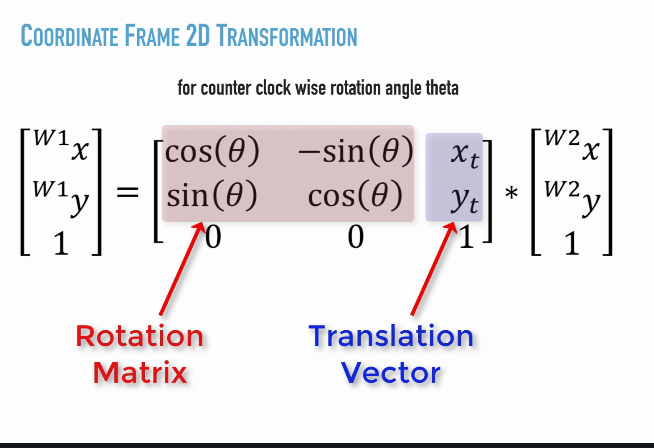  

Transformation Example:
Location in the __Robot__ and __World__ Coordinate Frames  
Robot: (3,3) in F{W}  
Person: (6, 3.5) in F{R}  

Question: What is the position of the person in the world frame?  

1. Determine the transformation matrix between the world frame and the robot frame  
Zero Rotation + (3,3) Translation vector  

2. Plug in info into transformation matrix:
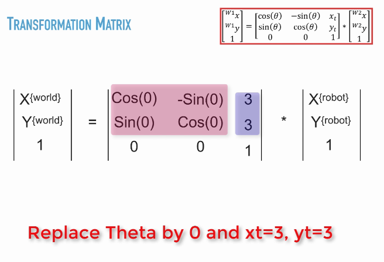  
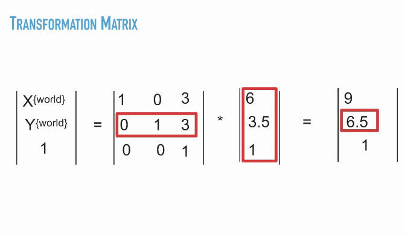 

## 3D Coordinate System & 3D Transformations
Ex: drone flies above the ground, altitude > 0, therefore we need a 3d coordinate system  

Roll/bank: rotation around x axis  
Pitch/attitude: rotation around y axis  
Yaw/heading: rotation around z axis  
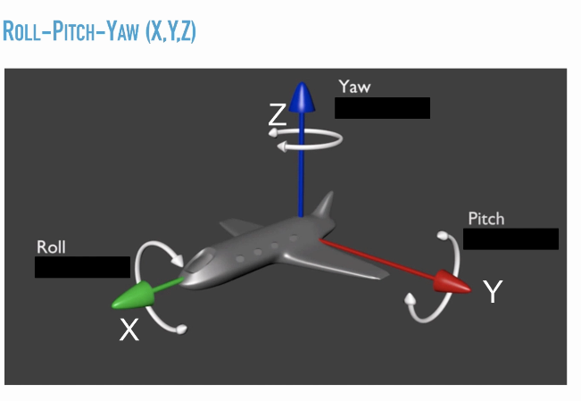  

Work with ground robot -> consider yaw only  
Work with flying drone -> consider all angles  
There are 3 rotation matrices for each angle  
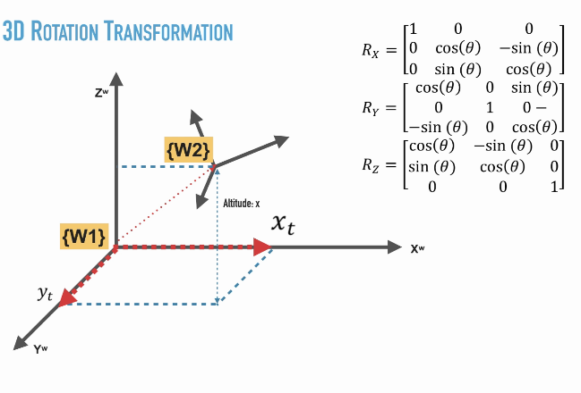  

Matrix Multiplication for 3d Transformations:  
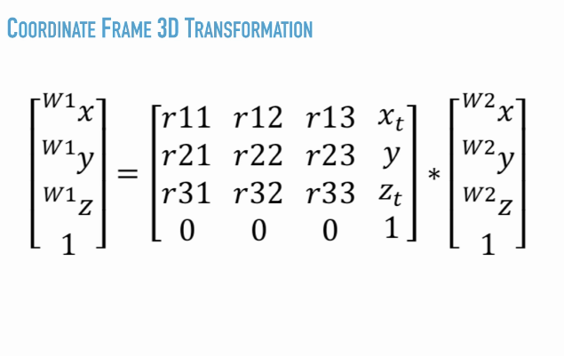  

### Orientation in 3D Space
__Rotation Representation Methods:__  
1. Three Angle Representation (Euler Representation vs Cardan Rotation)  
2. Rotation about Arbitrary Vector  
3. Quaternions  

__Three Angle Representation__:  
1. Euler Rotation Sequence: involves repetition, but not successive, of rotations about one particular axis  
Theorem(??): Any __two__ independent __orthonormal coordinate frames__ can be related by a sequence of rotations (not more than three) about coordinate axes, where __no two successive__ rotations may be about the same axis. 
2. Cardian Rotation Sequence: characterized by rotations about all three axes, specific case of a Euler Rotation

__Quaternions__: used by default in ROS for rotations  
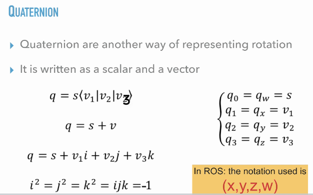  
More info at this website: https://www.euclideanspace.com/maths/geometry/rotations/conversions/quaternionToMatrix/index.htm  
It's possible to convert Euler Angles to Quaternion and vice versa: https://en.wikipedia.org/wiki/Conversion_between_quaternions_and_Euler_angles  

__Why Quaternion?__  
1. Compared to Euler angles they are simpler to compose and avoid the problem of gimbal lock  
2. Compared to rotation matrices they are more compact, more numerically stable, and more efficient  
3. Quaternions have application in computer graphics, computer vision, robotics, navigation, molecular dynamics, flight dynamics, orbital mechanics of satellites and crystallographic texture analysis (that's pretty cool!!)  

Essentially, when drone control is done through simple linearization of euler angles, the drone control is not robust enough against high disturbance and inclinations. But, when quaternions are used, the control of the drone is more robust even with sharp inclinations.  
Example demo here: https://www.youtube.com/watch?v=0VAc_G79POE  

## TF Package in ROS
TF package: ROS library that embeds all operations related to frames and transformations and makes them easy to utilize  
- stands for transformation libary in ROS  
- performs computation for transformations between frames  
- allows to find the pose of any object in any frame using transformations  
- robot is a collection of frames attached to its different joints (ie. body, actuators, sensors, etc)  
- frames are defined in every joint and component of the robot  

### URDF: Language for the Description of Frames and Transformations
__URDF__: Unified Robot Description Format, every robot in ROS is described in an XML format using the URDF. It is used by the navigation stack and the localization modules to localize the objects.   
- frames are attached to joints and called links  
- Relative position between the joints are defined as transformations specified by a translation vector and/or a rotation matrix.  
The translation vector is specified by the x y z coordinates of the vector and rotation is defined by roll pitch and yaw (rpy).  

- Any transformation between any two frames is defined in the URDF file. The URDF file is used by the navigation stack  

```xml
<joint name="base_joint" type="fixed">
  <parent link="base_footprint"/>
  <child link="base_link"/>
  <origin xyz="0.0 0.0 0.010" rpy="0 0 0"/>
</joint>
```
Explanantion of URDF above: There is a frame called "base_footprint" that is the parent of the frame "base_link" that is 1cm above the frame "base_footprint" with respect to the z axis

### Why is TF important?
1. Performs transformations easily  
2. The user does not need to worry about frames  
3. Provides built-in functions to publish and listen to frames in ROS

### TF Package Nodes
The TF package has several ROS nodes that provide utilities to manipulate frames and transformations in ROS. It can either be published by a broadcaster node or subscribed by a ROS node that listens to the frames.    
- view_frames: visualizes the full tree of coordinate transformations as a PDF file. run with `$ rosrun tf view_frames`
- tf_monitor: monitors transforms between frames. run with `$ rosrun tf tf_monitor` to find information about the frames that are active  
- tf_echo: prints specified transform from source frame to target frame onto the screen. run with `$ rosrun tf tf_echo odom base_footprint`.   
- roswtf: with the tfwtf plugin, helps you track down problems with tf  
- static_transform_publisher: command line tool for sending static transforms


Frames:  
map: represents global frame  
odom: frame relative to odometry (parent of base_footprint, child of map)  
base_footprint: attached to the base of the robot at its center (parent of other frames like sensors attached to the robot, child of odom frame)
